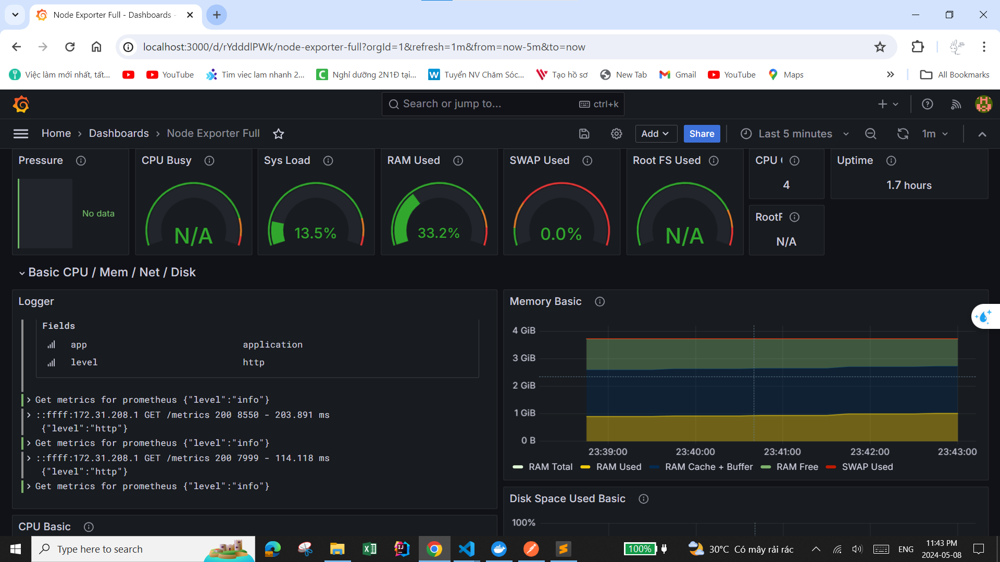

=======
# API FOR CHAT APP
# 💻 Technology and tools used
           

## Introducing the program
Provides APIs for a simple messaging application

## Schema

## Monitor System With Gafana, Prometheus, and Loki

## Swagger

### Auth Service
Provide authentication API for users

### Conversation Service

Provides APIs for both individual and group conversations

### Group Service

Provides APIs for easy chat group management

### Message Service

Provides APIs for user messaging which can be text images or videos

### User Service

Provides APIs for managing user information as well as user contacts

>>>>>>> be973b2b7a515ecbf88b532d809f42812f130edf
